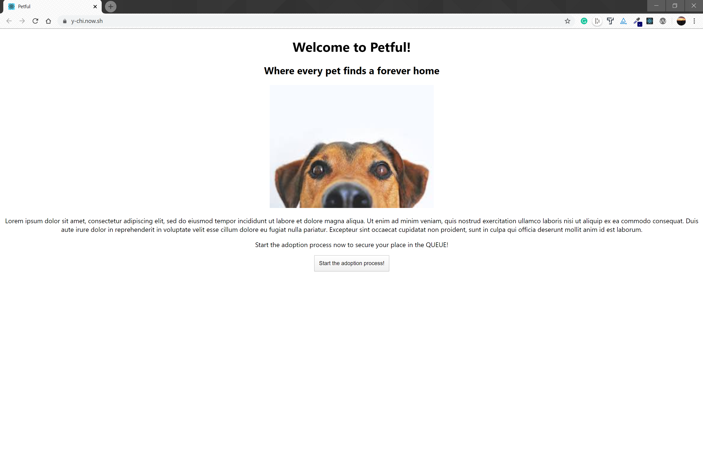
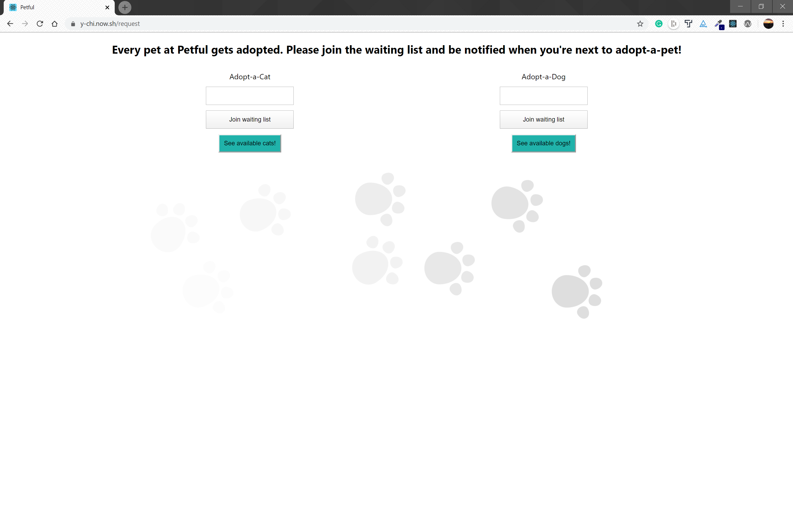
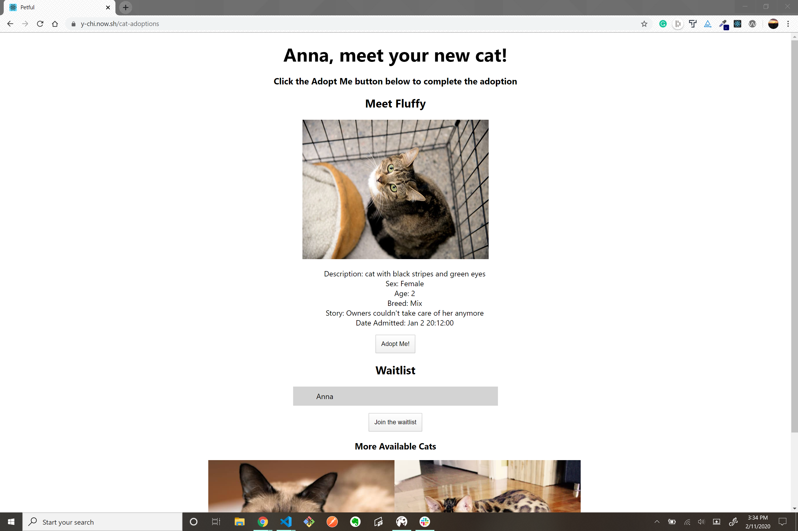
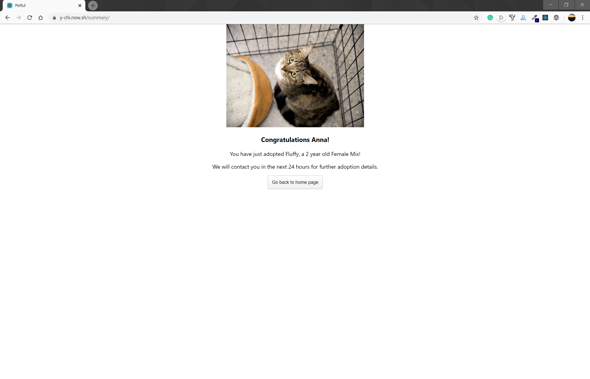

# Petful

A pet adoption app built by Sophia Koeut and Wendy Bartos for Thinkful's Engineering Immersion Program.

## The project

Petful operates on a first-in, first-out basis. Given a queue of dogs and a queue of cats (on the backend), users adopt the first available pet. As a new adopter, add your name to the waiting list and watch as each available pet gets adopted. When it's your turn to adopt your pet, click the adopt button to dequeue that pet and complete the adoption process!

## We'll do it live!

[Petful Live App](https://y-chi.now.sh/)

[Petful server (Github)](https://github.com/thinkful-ei-iguana/Wendy-Sophia-Petful-Server/)

## Technology Used

Front-End: _ReactJS | CSS_

Back-End: _NodeJS | ExpressJS_
